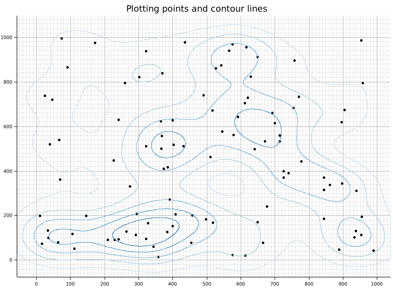

# Plotting-contours

Just some demo code to use [contour](https://crates.io/crates/contour) / [contour-isobands](https://crates.io/crates/contour-isobands) to generate contours from scattered points
and plot the result using [plotters](https://crates.io/crates/plotters) (following a request made on https://github.com/mthh/contour-isobands-rs/issues/1).


## Usage

```bash
cargo run --release
```

## Output


